# Dynamic Organizational Digital Twin (Corporate Digital Twin)

## 🏢 Executive Summary

The **Dynamic Organizational Digital Twin** is an advanced AI-powered simulation system that creates a functional and autonomous digital replica of an entire organization. Using sophisticated LLM agents, the system models a complete tech startup ecosystem where AI agents perform essential company functions in a simulated competitive market environment.

The primary objective extends beyond simple task completion to **organizational survival and growth** through intelligent decision-making, collaborative workflows, and adaptive learning in dynamic market conditions.

### 🎯 Key Value Propositions

- **Strategic Decision Testing**: Test organizational strategies in a risk-free environment
- **Leadership Development**: Train executives through realistic scenario simulation
- **Process Optimization**: Identify bottlenecks and inefficiencies before they impact real operations
- **Crisis Management**: Practice crisis response and business continuity planning
- **Market Intelligence**: Understand competitive dynamics and market responses
- **Organizational Learning**: Capture and apply institutional knowledge systematically

## 🏗️ System Architecture

### High-Level Architecture

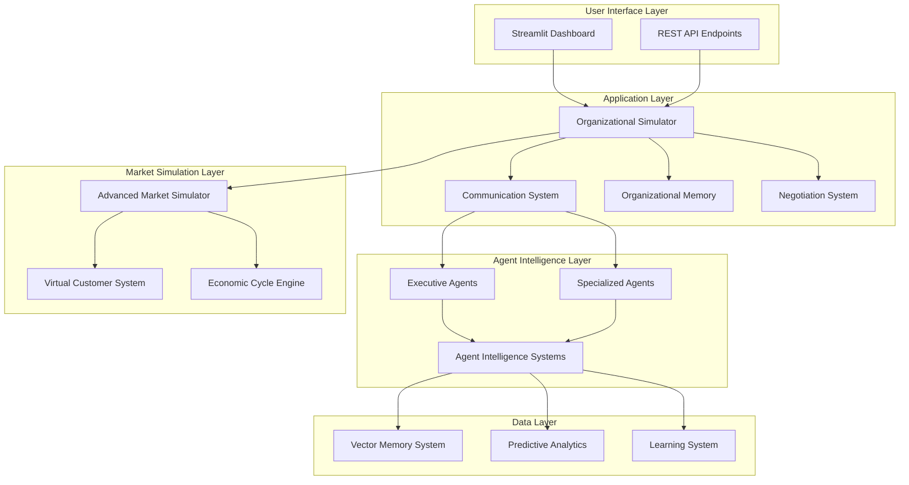

### Agent Ecosystem

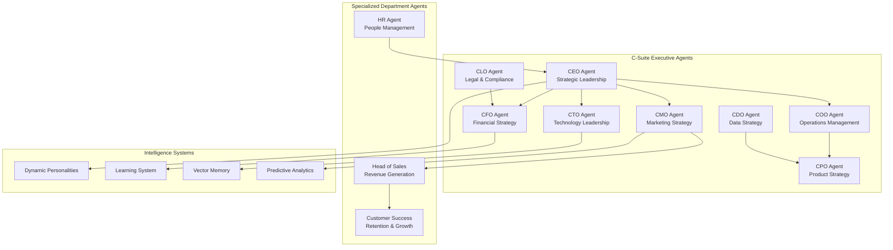

## 🤖 Agent Intelligence Framework

### Dynamic Personality System

Each agent possesses a sophisticated personality that evolves based on experiences and outcomes:

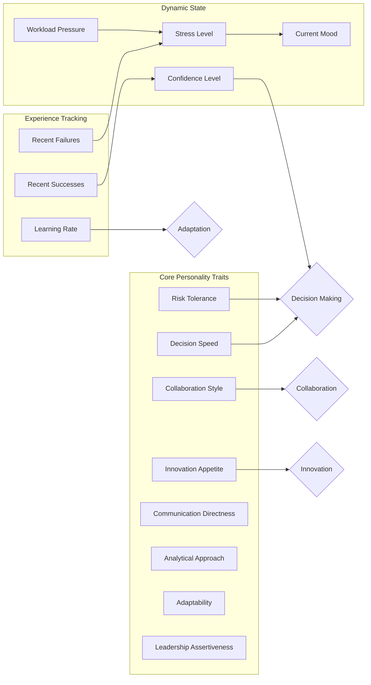

### Learning and Memory System

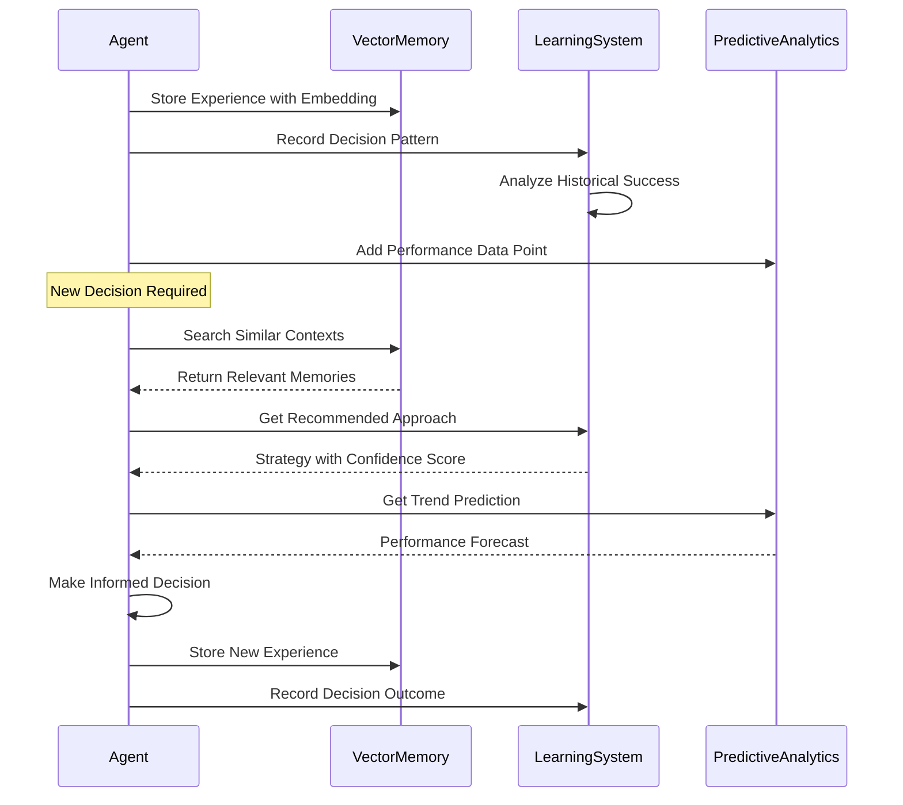

## 🏦 Market Simulation Engine

### Virtual Customer Ecosystem

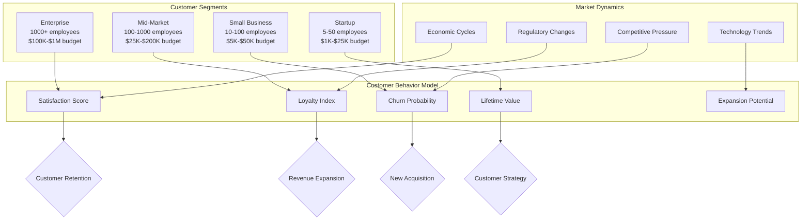

### Economic Cycle Simulation

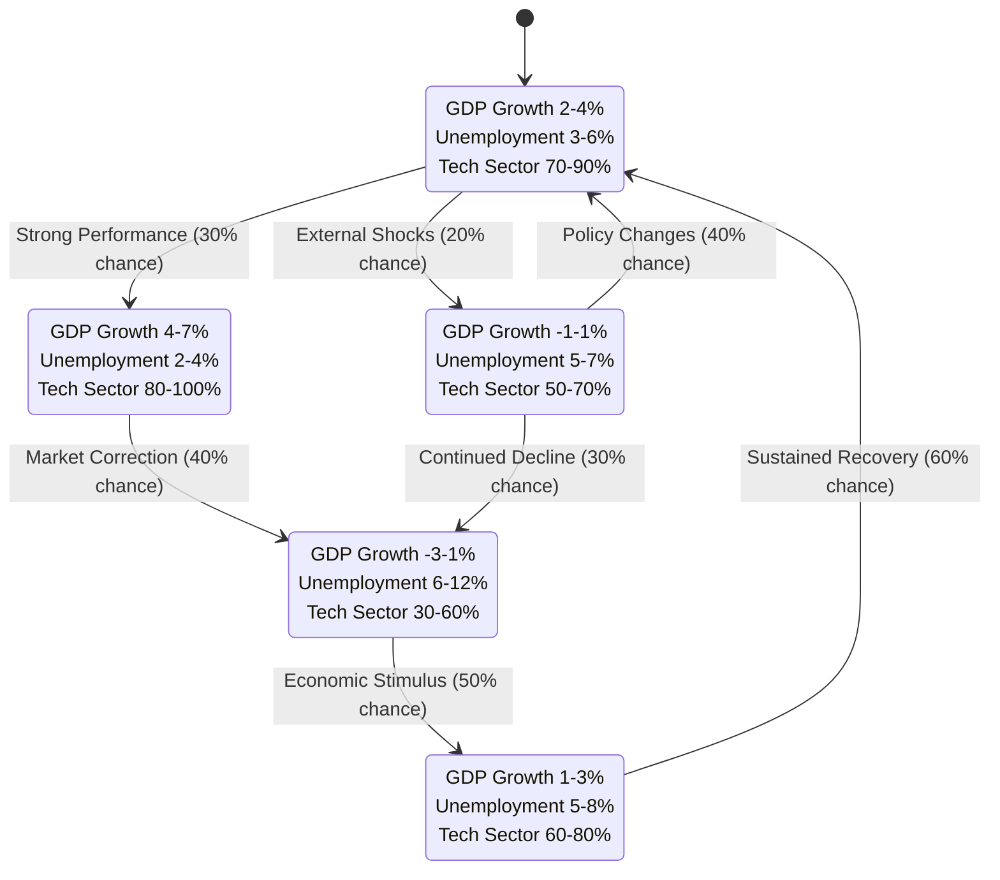

## 🔄 Operational Workflows

### Daily Simulation Cycle

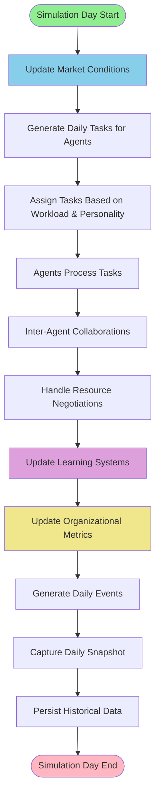

### Agent Task Processing Flow

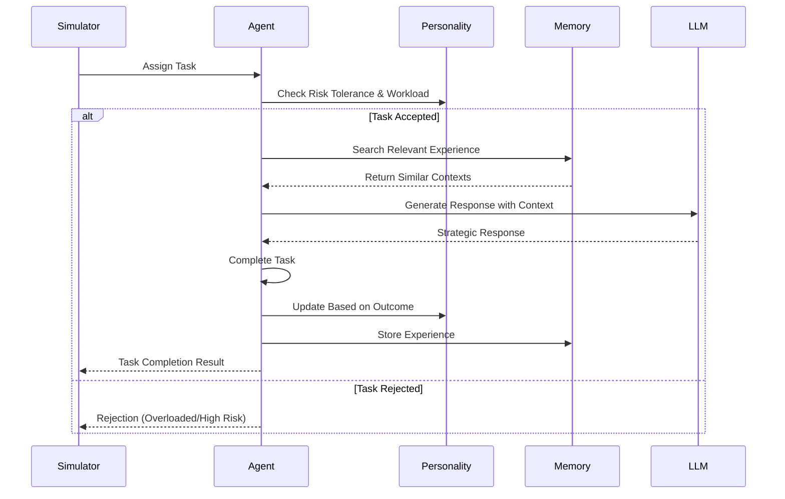

### Crisis Response Workflow

```mermaid
flowchart LR
    CRISIS[Crisis Injected] --> DETECT[Crisis Detection]
    DETECT --> ALERT[Alert All Agents]
    ALERT --> ASSESS[Agent Assessment]
    ASSESS --> CONSULT[Inter-Agent Consultation]
    CONSULT --> STRATEGY[Strategy Formation]
    STRATEGY --> IMPLEMENT[Implementation]
    IMPLEMENT --> MONITOR[Monitor Effectiveness]
    MONITOR --> ADJUST[Adjust Strategy]
    ADJUST --> LEARN[Learn from Crisis]
    LEARN --> PREPARE[Prepare for Future]
    
    style CRISIS fill:#FF6B6B
    style ALERT fill:#FFE66D
    style STRATEGY fill:#4ECDC4
    style LEARN fill:#45B7D1
```

## 📊 Performance Monitoring

### Key Performance Indicators

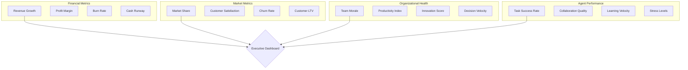

## 🚀 Quick Start Guide

### Prerequisites

- Python 3.8 or higher
- OpenAI API key (GPT-4 recommended)
- 8GB RAM minimum (16GB recommended)
- Modern web browser

### Installation

1. **Clone the Repository**
   ```bash
   git clone <repository-url>
   cd organizational-digital-twin
   ```

2. **Install Dependencies**
   ```bash
   pip install -r requirements.txt
   ```

3. **Configure Environment**
   ```bash
   cp .env.example .env
   # Edit .env file with your OpenAI API key
   ```

4. **Launch Application**
   ```bash
   python run.py
   ```

5. **Access Dashboard**
   ```
   Open browser to: http://localhost:8501
   ```

### Quick Configuration

```python
# config.py - Key Configuration Options
ORGANIZATION_NAME = "Your Startup Name"
INITIAL_BUDGET = 1000000  # Starting budget in USD
SIMULATION_SPEED = "normal"  # normal, fast, slow
OPENAI_MODEL = "gpt-4-1106-preview"
MAX_TOKENS_PER_RESPONSE = 1000
```

## 🎮 Usage Scenarios

### 1. Strategic Planning Simulation

Test strategic decisions in a risk-free environment:

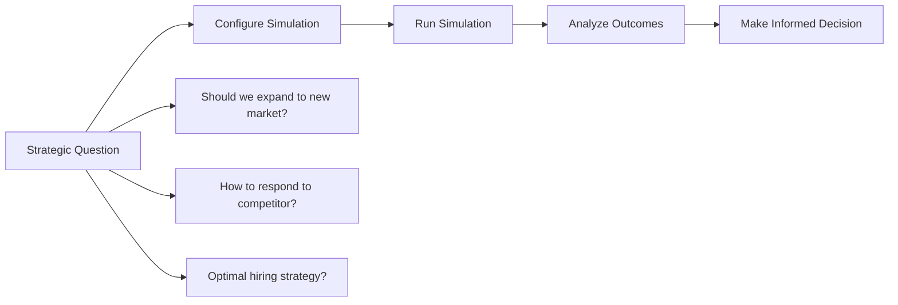

### 2. Crisis Management Training

Practice organizational response to various crisis scenarios:

- **Market Downturns**: Economic recession impact
- **Competitive Threats**: Disruptive competitor actions
- **Talent Loss**: Key personnel departures
- **Funding Challenges**: Investment round difficulties
- **Regulatory Changes**: New compliance requirements

### 3. Process Optimization

Identify and resolve organizational inefficiencies:

- **Communication Bottlenecks**: Inter-department friction
- **Decision Delays**: Slow consensus building
- **Resource Conflicts**: Budget allocation disputes
- **Skill Gaps**: Training and development needs

## 🔧 Advanced Features

### AI Agent Customization

```python
# Create custom agent personality
from core.agent_intelligence import AgentPersonality

custom_personality = AgentPersonality(
    risk_tolerance=0.8,
    innovation_appetite=0.9,
    collaboration_style=0.7,
    decision_speed=0.6
)

# Apply to agent
agent.personality = custom_personality
```

### Market Scenario Injection

```python
# Inject custom market conditions
market_event = {
    "type": "competitive",
    "event": "Major competitor launches AI product",
    "impact": "negative",
    "severity": 0.7
}

simulator.market_simulator.inject_event(market_event)
```

### Custom Analytics Dashboard

```python
# Add custom metrics tracking
simulator.add_custom_metric(
    name="innovation_velocity",
    calculation=lambda agents: sum(a.personality.innovation_appetite for a in agents) / len(agents)
)
```

## 📈 Business Impact

### ROI Measurement

- **Reduced Decision Risk**: Test strategies before real implementation
- **Accelerated Learning**: Compress months of experience into days
- **Improved Coordination**: Identify communication gaps early
- **Crisis Preparedness**: Practice response scenarios
- **Strategic Clarity**: Validate assumptions with data

### Success Metrics

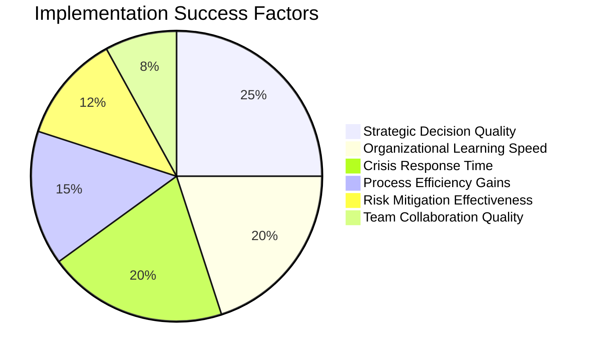

## 🔮 Future Roadmap

### Phase 2: Enhanced Intelligence

- **GPT-4 Vision Integration**: Document and visual analysis
- **Real-time Market Data**: Live market feed integration
- **Advanced ML Models**: Custom prediction algorithms
- **Multi-language Support**: Global organization modeling

### Phase 3: Enterprise Features

- **Single Sign-On (SSO)**: Enterprise authentication
- **API Integration**: CRM, ERP, and business system connections
- **Custom Reporting**: Automated executive reports
- **Multi-tenant Architecture**: Multiple organization support

### Phase 4: Ecosystem Expansion

- **Industry Templates**: Sector-specific agent configurations
- **Marketplace Integration**: Third-party agent modules
- **Certification Programs**: Professional training courses
- **Community Platform**: User knowledge sharing

## 🛡️ Security & Compliance

### Data Protection

- **Encryption**: All data encrypted at rest and in transit
- **Privacy**: No sensitive data stored without consent
- **Compliance**: GDPR, CCPA, and SOC 2 Type II ready
- **Access Control**: Role-based permissions
- **Audit Trail**: Complete action logging

### API Security

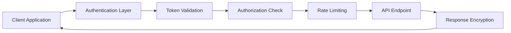

## 🤝 Contributing

We welcome contributions from the community! Please see our [Contributing Guidelines](CONTRIBUTING.md) for details.

### Development Setup

```bash
# Development environment setup
git clone <repository-url>
cd organizational-digital-twin
python -m venv venv
source venv/bin/activate  # On Windows: venv\Scripts\activate
pip install -r requirements-dev.txt
pre-commit install
```

### Testing

```bash
# Run test suite
pytest tests/
pytest tests/ --cov=src/  # With coverage
```

## 📞 Support

- **Documentation**: [Full Documentation](docs/)
- **Issues**: [GitHub Issues](https://github.com/your-org/organizational-digital-twin/issues)
- **Discussions**: [GitHub Discussions](https://github.com/your-org/organizational-digital-twin/discussions)
- **Email**: support@organizational-twin.com

## 📄 License

This project is licensed under the MIT License - see the [LICENSE](LICENSE) file for details.

## 🙏 Acknowledgments

- OpenAI for providing the GPT-4 foundation
- Streamlit for the excellent web framework
- The open-source community for inspiration and tools

---

**Built with ❤️ for the future of organizational intelligence**

*Transform your organization's decision-making with AI-powered simulation* 